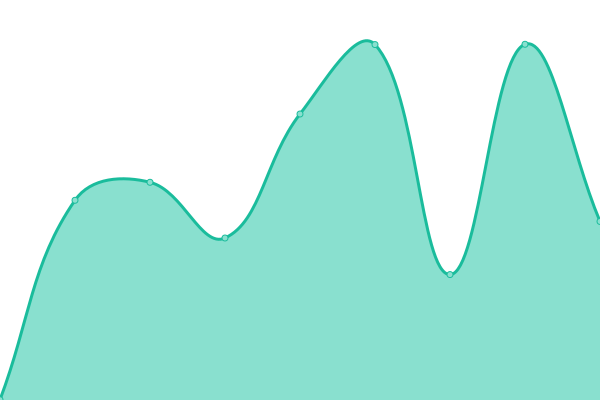
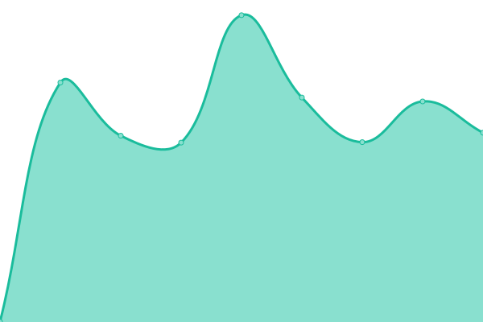

# [📈 Live Status](https://status.therainbow.dev): <!--live status--> **🟧 Partial outage**

This repository contains the open-source uptime monitor and status page for [Upptime](https://upptime.js.org), powered by [Upptime](https://github.com/upptime/upptime).

With [Upptime](https://upptime.js.org), you can get your own unlimited and free uptime monitor and status page, powered entirely by a GitHub repository. We use [Issues](https://github.com/upptime/upptime/issues) as incident reports, [Actions](https://github.com/upptime/upptime/actions) as uptime monitors, and [Pages](https://status.therainbow.dev) for the status page.

<!--start: status pages-->
<!-- This summary is generated by Upptime (https://github.com/upptime/upptime) -->
<!-- Do not edit this manually, your changes will be overwritten -->
<!-- prettier-ignore -->
| URL | Status | History | Response Time | Uptime |
| --- | ------ | ------- | ------------- | ------ |
|  [Main Website](https://therainbow.dev) | 🟩 Up | [main-website.yml](https://github.com/TheRainbowDev/upptime-monitor/commits/HEAD/history/main-website.yml) | 

 363ms
     
 | 

<a href="https://status.therainbow.dev/history/main-website">100.00%</a>
    

|  [Website Hosting](https://rainbowdev.host) | 🟩 Up | [website-hosting.yml](https://github.com/TheRainbowDev/upptime-monitor/commits/HEAD/history/website-hosting.yml) | 

 718ms
     
 | 

<a href="https://status.therainbow.dev/history/website-hosting">100.00%</a>
    

|  [Our-Cloud](https://our-cloud.therainbow.dev) | 🟥 Down | [our-cloud.yml](https://github.com/TheRainbowDev/upptime-monitor/commits/HEAD/history/our-cloud.yml) | 

 4465ms
     
 | 

<a href="https://status.therainbow.dev/history/our-cloud">100.00%</a>
    

<!--end: status pages-->

[**Visit our status website →**](https://status.therainbow.dev)

## 📄 License

- Powered by: [Upptime](https://github.com/upptime/upptime)
- Code: [MIT](./LICENSE) © [Upptime](https://upptime.js.org)
- Data in the `./history` directory: [Open Database License](https://opendatacommons.org/licenses/odbl/1-0/)
